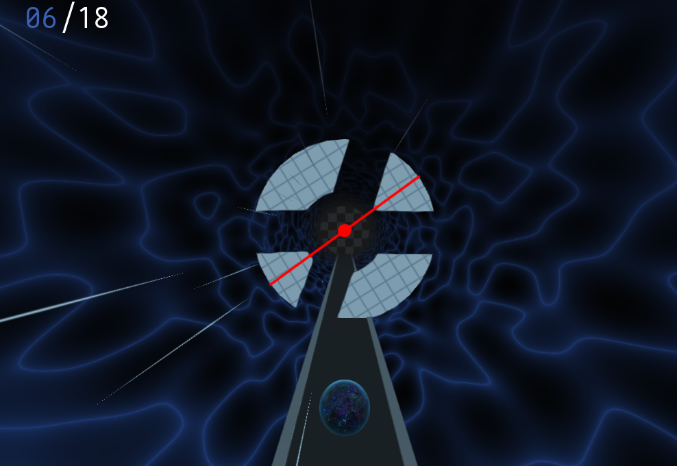

# Symmetry Gap
## use symmetry to create gaps in the obstacles

This game was created for Godot Wild Jam 47 with the theme SYMMETRY.

[You can play it on itch!](https://fruityfusion.itch.io/mirrored-gaps)

### Third-Party Credits
Sound effects from freesound.org made by [bubaproducer](https://freesound.org/people/bubaproducer/sounds/151018/), [Kastenfrosch](https://freesound.org/people/Kastenfrosch/sounds/162481/), [radiolarp](https://freesound.org/people/radiolarp/sounds/321840/), [neezen.](https://freesound.org/people/neezen./sounds/503815/).
Music themes from [soundimage.org](https://soundimage.org).
The SFX and music located in Assets/Sounds are partially licensed under an attribution license, please respect it.

With use of Universal Fade plugin by KoBeWi, KenneyNL prototyping textures, and a 3D-Simplex implementation by Ian McEwan.